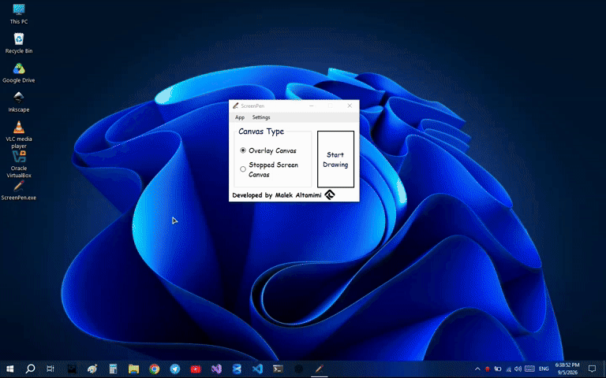

# ScreenPen

> A simple Windows application for drawing directly on your screen.





## Overview

**ScreenPen** is a lightweight Windows application that lets you draw directly on your screen.

It was created as a practical project inspired by seeing people use similar tools to explain concepts and demonstrate software by drawing directly on their screens.

ScreenPen provides two different canvas modes, giving you the choice between drawing over a live screen or working on a captured, static version of it.

## Features

* 🖊️ **Draw directly on your screen**
* 🖼️ **Two canvas modes**

  * **Overlay Canvas** — draw over your live desktop while the underlying screen remains visible and continues to update normally.
  * **Stopped Screen Canvas** — capture the screen and draw on a static representation of it.
* 🎨 **Custom pen colors**
* 📏 **Adjustable pen width** 
* 🧽 **Eraser tool** with independently adjustable width
* ↩️ **Undo and redo**
* 💾 **Save your canvas** as an image
* 🖥️ **Multi-monitor support**
* 🎛️ **Floating Tools Panel** for quick access to drawing controls
* 📌 **Dockable Tools Panel**
* ⌨️ **Keyboard shortcuts**
* 🖱️ **Context menu controls**
* 🔝 **Always-on-top main window option**
* 📂 **Quick access to saved canvases**
* 📦 **Portable** — no installer required

## Canvas Modes

### Overlay Canvas

The Overlay Canvas places a transparent drawing layer over your screen.

The underlying desktop remains visible and continues to update normally while you draw on top of it.

This mode is useful for:

* Explaining software
* Live demonstrations
* Presentations
* Recording tutorials
* Highlighting content on the desktop

### Stopped Screen Canvas

The Stopped Screen Canvas captures the screen and turns it into a static canvas.

Instead of drawing over the live desktop, you can work on the captured screen as an image while using the same drawing tools.

This mode is useful when you want a stable canvas that does not change while you are drawing.

## Getting Started

1. Launch **ScreenPen**.
2. Choose your preferred canvas mode.
3. Click **Start Drawing**.
4. Select the **Pen** or **Eraser**.
5. Start drawing using the selected tool.

The **Tools Panel**, context menu, and keyboard shortcuts provide quick access to the available controls.

The Tools Panel provides access to:

* Pen and eraser selection
* Pen color
* Pen width
* Eraser width
* Undo / redo
* Save

The Tools Panel can also be hidden when it is not needed and shown again using the context menu or keyboard shortcut.

## Keyboard Shortcuts

| Shortcut           | Action           |
| ------------------ | ---------------- |
| `Ctrl + Z`         | Undo             |
| `Ctrl + Shift + Z` | Redo             |
| `Ctrl + S`         | Save             |
| `Ctrl + M`         | Show Menu        |
| `Ctrl + Shift + M` | Hide Menu        |
| `Ctrl + Shift + X` | Close Canvas     |
| `F12`              | Show Tools Panel |
| `Ctrl + Shift + R` | Reset Canvas     |
| `...`              | More shortcuts   |

> Additional shortcuts can be discovered through the application's menus.

## Saving

When you save a canvas, ScreenPen creates an image of the virtual screen and stores it in the saved-canvas directory.

Saved canvases are stored under:

```text
Pictures/
└── ScreenPen/
```

The saved-canvas folder can also be opened directly from the application.

## Multi-Monitor Support

ScreenPen supports multiple displays and automatically detects the connected screens.

Each screen has its own canvas while remaining integrated into the same drawing session, allowing ScreenPen to be used across an extended desktop setup.

## Tools Panel

ScreenPen uses a dedicated floating **Tools Panel**.

The panel provides quick access to the most frequently used drawing controls and can be:

* Moved freely around the screen
* Hidden when not needed
* Docked to the top-center of the primary display

To dock or undock the panel, right-click the Tools Panel and select the appropriate option.

## Installation

ScreenPen is distributed as a **portable executable**, so no installer is required.

### Download

Download the latest release from the GitHub Releases page:

**https://github.com/maketmimi/ScreenPen/releases/download/v1.0.0/ScreenPen.exe**

### Requirements

* Windows 10 or later
* .NET Framework 4.7.8

ScreenPen has been tested on:

* Windows 10
* Windows 11

> Windows 7 is not officially supported and may not work reliably.

## Why I Built ScreenPen

ScreenPen was built as a learning project and as a practical exploration of desktop application development with C# and Windows Forms.

The idea came from seeing people use similar tools while explaining software and concepts in videos. I found the idea useful and decided to build my own implementation from scratch.

Through this project, I explored areas such as screen overlays, multiple displays, drawing systems, transparency, custom cursors, bitmap manipulation, window management, input handling, and desktop UI design.

## Status

**ScreenPen is currently at its first stable release.**

This release represents the first complete version of the application.

Future improvements may be added over time.

## Contributing

Contributions, suggestions, bug reports, and ideas are welcome.

If you find a bug or have an idea for improving ScreenPen, feel free to open an issue or submit a pull request.

**Repository:** https://github.com/maketmimi/ScreenPen

## License

ScreenPen is open-source software licensed under the **MIT License**.

See the [LICENSE](LICENSE) file for the full license text.

---

**Built with C# and Windows Forms.**
